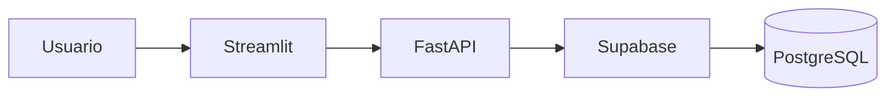

# 🚗 RentaCar

## Descripción

RentaCar es un sistema de gestión de alquiler de vehículos desarrollado utilizando una arquitectura cliente-servidor.

El sistema permite administrar clientes, vehículos y alquileres mediante una interfaz web intuitiva desarrollada con Streamlit y respaldada por una API REST construida con FastAPI.

Toda la información es almacenada en Supabase utilizando PostgreSQL como motor de base de datos.

---

## Características principales

* Gestión de clientes.
* Gestión de vehículos.
* Gestión de alquileres.
* Consulta de vehículos disponibles.
* API REST documentada automáticamente.
* Interfaz web amigable para administradores.

---

## Arquitectura del sistema

El sistema está dividido en varias capas para garantizar una correcta separación de responsabilidades:

* **Frontend (Streamlit)** → Interfaz de usuario.
* **API (FastAPI)** → Gestión de endpoints y reglas de negocio.
* **Schemas (Pydantic)** → Validación de datos.
* **Storage (Supabase)** → Persistencia de datos.
* **PostgreSQL** → Almacenamiento de información.

### Flujo General

---

## Objetivo del Proyecto

Desarrollar un sistema de gestión de alquiler de vehículos aplicando buenas prácticas de ingeniería de software:

* Arquitectura por capas.
* Separación de responsabilidades.
* Validación de datos con Pydantic.
* Persistencia en PostgreSQL.
* Consumo de API REST.
* Pruebas automatizadas con Pytest.
* Documentación técnica con MkDocs.

---

## Tecnologías Utilizadas

| Tecnología | Uso                |
| ---------- | ------------------ |
| Python     | Lenguaje principal |
| FastAPI    | Backend            |
| Streamlit  | Frontend           |
| Supabase   | Base de datos      |
| PostgreSQL | Persistencia       |
| Pytest     | Pruebas            |
| MkDocs     | Documentación      |

